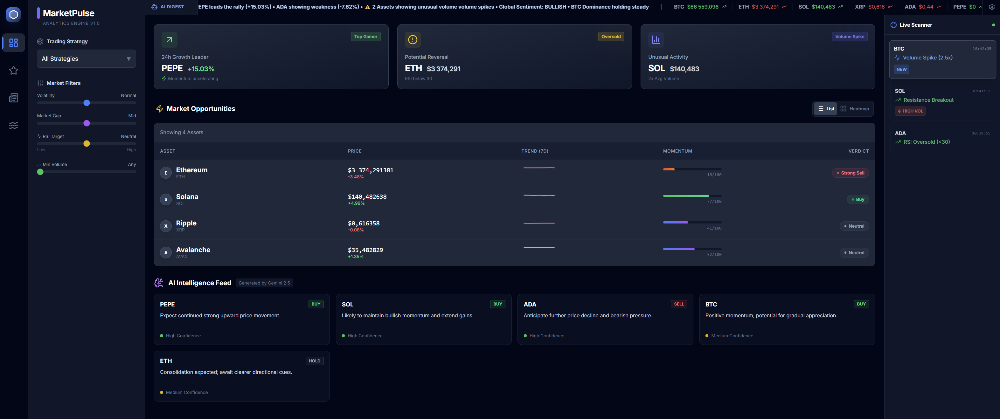

<div align="center">
  <a href="https://taapi.io/">
    
  </a>
  &nbsp;&nbsp;&nbsp;&nbsp;
  <a href="https://sdh.global/">
    
  </a>
</div>

# Real-Time Market Scanner & Analytics Engine

## About MarketPulse

MarketPulse is an AI-Powered Real-Time Market Scanner & Analytics Engine designed to demonstrate how to build professional trading tools without complex backend engineering. By leveraging **Taapi.io**, it focuses on UI and logic rather than data normalization.



### Key Features

*   **Live Scanner:** Instead of static charts, the dashboard processes live updates on key market indicators.
*   **Smart Scoring:** Automatically calculates a "Verdict" (e.g., "Strong Buy") using indicators like RSI and MACD.
*   **AI-Driven Intelligence:** Aggregates real-time news and uses Generative AI to explain market movements and calculate Sentiment Scores.
*   **Whale Activity Tracker:** Monitors volume spikes and large wallet movements to detect accumulation or sell pressure.

### How It Works

The engine is powered by the **Taapi.io API**, providing instant access to over 200+ technical indicators (RSI, MACD, Bollinger Bands, etc.) and real-time data across 500+ exchanges. This allows the scanner to pull accurate, up-to-date information without the need for maintaining complex calculation servers.

## Run Locally

**Prerequisites:**  Node.js

1.  **Install dependencies:**
    ```bash
    npm install
    ```

2.  **Configure API Key:**
    -   Create a `.env` file in the root directory (copy from `.env.example` if available, or just create it).
    -   Add your `taapi.io` API key:
        ```env
        VITE_TAAPI_SECRET=your_taapi_secret_here
        ```
    -   *Note: The app is configured to respect the Free Tier rate limits (1 request every 1.5s). If you have a paid plan, you can adjust the delay in `App.tsx`.*

3.  **Run the app:**
    ```bash
    npm run dev
    ```

4.  **Build for production:**
    ```bash
    npm run build
    ```

---

### For Developers
Want to build this yourself? We have released the core logic as an open-source blueprint. [Read the full article here](https://taapi.io/news/building-aI-real-time-market-scanner)

### For Enterprise
Need a turnkey version of this scanner for your exchange or fund? This solution was architected by **SDH.global**, a certified Taapi.io integration partner. [Contact SDH.global for Custom Development](https://sdh.global/)
